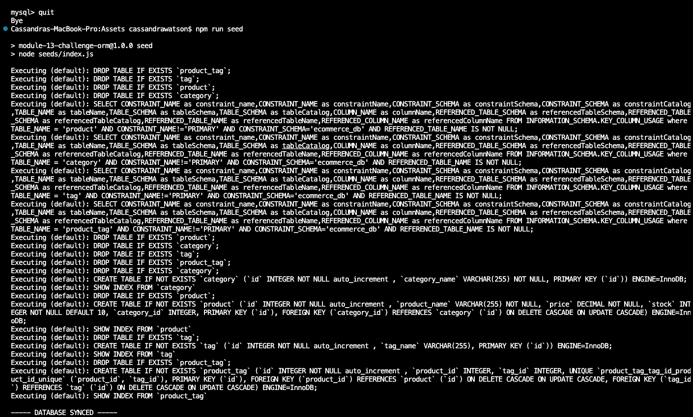
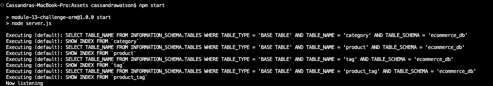

# ecommerceBackend

  

## Description

This ecommerceBackend allows an internet retail company to use a backend e-commerce website that uses that latest technologies so that they can continue to compete with other e-commerce companies. 

## Table of Contents 

- [Installation](#installation)
- [Usage](#usage)
- [How to Contribute](#contributions)
- [Tests](#tests)
- [Credits](#credits)
- [Questions](#questions)

## Installation 

To install this package, you will gather the files from the [ecommerceBackend GitHub Respoitory by Cassandra Watson](https://github.com/cassiewatsonn/ecommerceBackend). Once you have all of the files, navigate to your terminal and input 'npm install'. This will install the express, dotenv, my sql and sequelize packages from the package.json file. 

## Usage 

Here is a video displaying how to application works: [ecommerceBackend Video](https://drive.google.com/file/d/1gU8VBI8_qP_yz_JnXdsWasTFzKdkuSbE/view)

After you have successfully installed the package (if you have not yet installed, please refer to [Installation](#installation)), When I add my database name, MySQL username, and MySQL password to an environment variable file, then I am able to connect to a database using Sequelize. You will do this by inputting 'mysql -u root -p' in the terminal, click enter then enter your password. 
After you have successfully entered your password, enter schema and seed commands, then a development database is created and is seeded with test data. Do this by inputting 'source db/schema.sql;' into the terminal. Once you have done this it should look like the following picture: 
## 

Once you have that done, input 'quit' to your terminal. Next, input 'npm run seed'; it should now look something like this: 
## 

Finally, when you enter the command to invoke the application, then the server is started and the Sequelize models are synced to the MySQL database. Do this by inputting 'npm start' and you should receive a message like this: 
## 

Now, go to insomnia. When you open API GET routes in Insomnia for categories, products, or tags, then the data for each of these routes is displayed in a formatted JSON. When you test API POST, PUT, and DELETE routes in Insomnia, then you are able to successfully create, update, and delete data in the database.

## License Description

MIT License

Copyright (c) [2023]
    
Permission is hereby granted, free of charge, to any person obtaining a copy
of this software and associated documentation files (the "Software"), to deal
in the Software without restriction, including without limitation the rights
to use, copy, modify, merge, publish, distribute, sublicense, and/or sell
copies of the Software, and to permit persons to whom the Software is
furnished to do so, subject to the following conditions:
    
The above copyright notice and this permission notice shall be included in all
copies or substantial portions of the Software.
    
THE SOFTWARE IS PROVIDED "AS IS", WITHOUT WARRANTY OF ANY KIND, EXPRESS OR
IMPLIED, INCLUDING BUT NOT LIMITED TO THE WARRANTIES OF MERCHANTABILITY,
FITNESS FOR A PARTICULAR PURPOSE AND NONINFRINGEMENT. IN NO EVENT SHALL THE
AUTHORS OR COPYRIGHT HOLDERS BE LIABLE FOR ANY CLAIM, DAMAGES OR OTHER
LIABILITY, WHETHER IN AN ACTION OF CONTRACT, TORT OR OTHERWISE, ARISING FROM,
OUT OF OR IN CONNECTION WITH THE SOFTWARE OR THE USE OR OTHER DEALINGS IN THE
SOFTWARE.
[MIT License Link](https://choosealicense.com/licenses/mit)

## Contributions

Please contact me if you would like to contribute. You can find my information under the [Questions](#questions) section. 

## Tests 

N/A

## Credits 

Thank you to my study partner's [Rebecca Lawrence](https://github.com/rkml14), [Mozhdeh Khorashahi](https://github.com/mojsun/E-commerce-Back-End) and my tutor Eric Sayer!

## Questions 

[Cassandra Watson's GitHub Profile](https://github.com/cassiewatsonn)

For any additional questions, please contact me by email at cassiewatsonn@gmail.com !